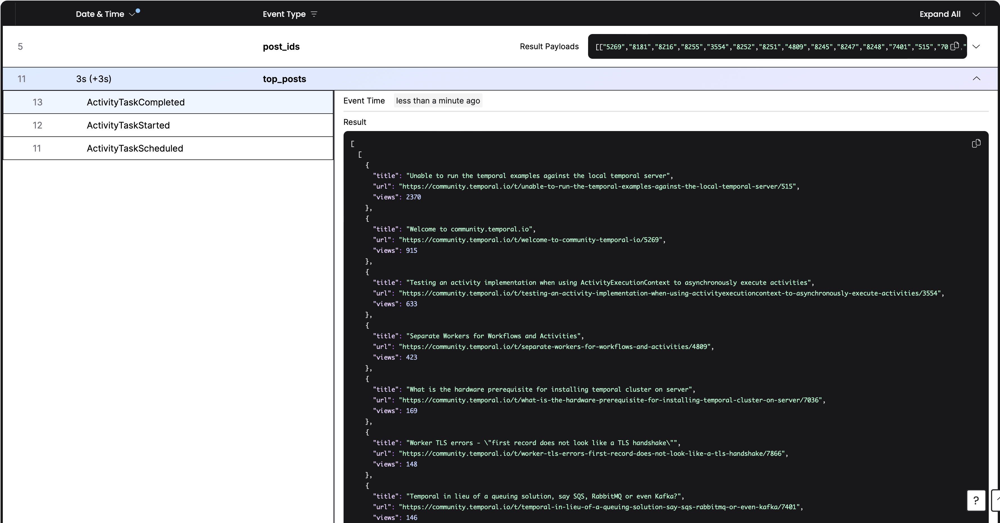

# Build a data pipeline Workflow with Temporal and Python

For the complete tutorial, see [Build a data pipeline Workflow with Temporal and Python](https://learn.temporal.io/tutorials/python/data-pipelines/).

Temporal makes writing data pipelines easy with Workflows and Activities.

You can create a source, process the step or steps, and output the flow of information to a destination with just code. Meaning all of your developer best practices can be implemented, tested, and ran as needed.

That data that enters a Workflow is handled by Activities, while the Workflow orchestrates the execution of those steps.
You can ensure that Temporal handles all actions and executes it observably once, all in Python code.

In this tutorial, you'll learn to build a data pipeline that gets the top 10 Hacker New stories and processes the items based on the story ID.
If the API endpoint is down, the default behavior of the Retry Policy is to retry indefinitely.

You'll then implement a Schedule to Schedule Workflows on an interval to leverage the automation of running Workflow Executions.

## Step 0: Prerequisites

* Python >= 3.7
* [Poetry](https://python-poetry.org)
* [Local Temporal server running](https://docs.temporal.io/application-development/foundations#run-a-development-cluster)

With this repository cloned, run the following at the root of the directory:

```command
poetry install
```

## Start the Workflow

Start and run the Workflow with the following commands:

```command
# terminal one
poetry run python run_worker.py
# terminal two
poetry run python run_workflow.py
```

Terminate the Workflow with the following command:

```command
# terminal three
temporal workflow terminate --workflow-id temporal-community-workflow
```

## Results

You'll see an output similar to the following in your terminal::

```command
Top 10 stories on Temporal Community:
                                               Title                                                URL  Views
0  Unable to run the temporal examples against th...  https://community.temporal.io/t/unable-to-run-...   2370
1                   Welcome to community.temporal.io  https://community.temporal.io/t/welcome-to-com...    915
2  Testing an activity implementation when using ...  https://community.temporal.io/t/testing-an-act...    633
3      Separate Workers for Workflows and Activities  https://community.temporal.io/t/separate-worke...    423
4  What is the hardware prerequisite for installi...  https://community.temporal.io/t/what-is-the-ha...    169
5  Worker TLS errors - "first record does not loo...  https://community.temporal.io/t/worker-tls-err...    148
6  Temporal in lieu of a queuing solution, say SQ...  https://community.temporal.io/t/temporal-in-li...    146
7  Implement Finite State Machine Transitioning i...  https://community.temporal.io/t/implement-fini...     97
8         Cassandra history_node table keeps growing  https://community.temporal.io/t/cassandra-hist...     91
9  Getting error TransportError (InvalidCertifica...  https://community.temporal.io/t/getting-error-...     74
```

You'll see an output similar to the following in the Temporal Web UI:

